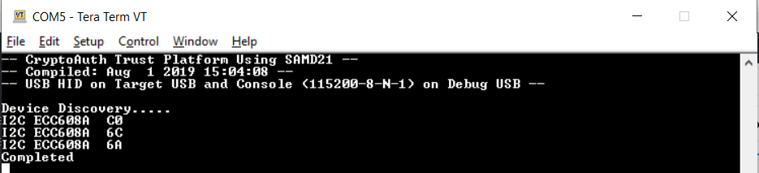
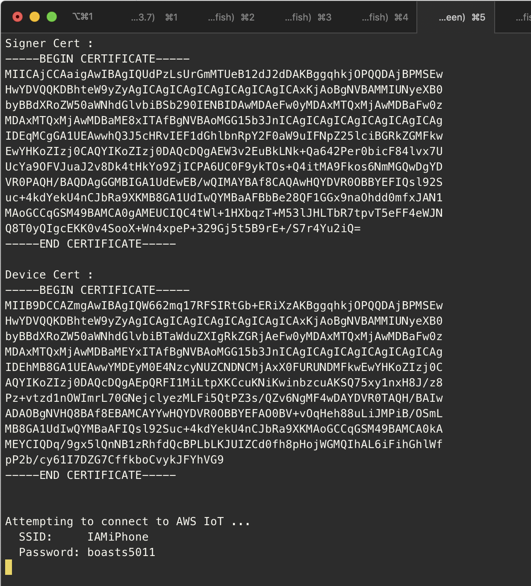
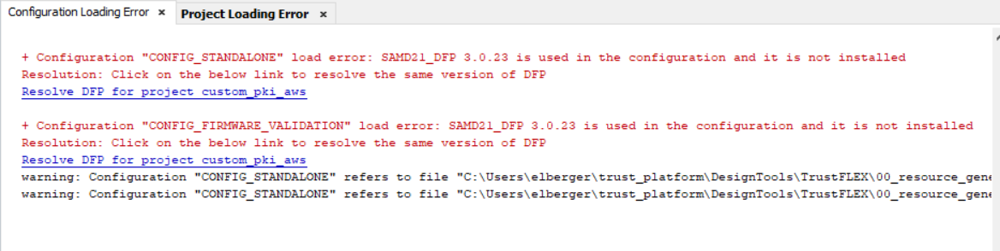
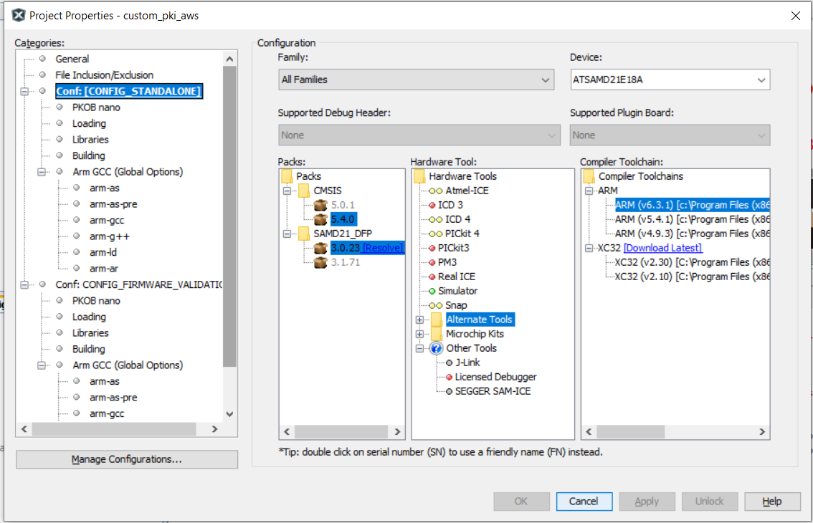
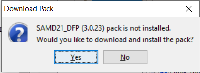
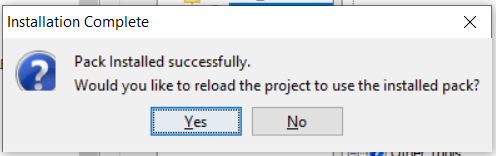

# Lab 2

**How this document works**

This workshop is primarily driven by the documentation in the Microchip Trust Platform Design Suite located in trust_platform/DesignTools/Docs.  If there is any expansion or localized managed lab correction, it will be written here.

Each major heading section relates to each major section in **trust_platform/DesignTools/Docs/TrustFLEX_guide_custom_PKI_AWS.pdf**.  Locate and open this document.

If you are running these steps in an unmanaged workshop capacity (in your own account) please implement the steps defined in the document **TrustFLEX_guide_AWS_demo_account_setup.pdf** before continuing.  In a managed workshop capacity this step has been done for you.


# 1. Introduction

If you have never used Jupyter notebooks before, please read this section.  Otherwise, move to the next section.

# 2. Jupyter Notebook Tutorials

The two notebooks we will be using in this Lab include:

* TrustFLEX\00_resource_generation\TFLXTLS_resource_generator.ipynb
* TrustFLEX\06_custom_pki_aws\notebook\ TFLXTLS_aws_connect.ipynb

# 3. Resource Generation

In this section, you will prepare the device resources for the ECC608A.

1. Connect your kit to your workstation.
   1. Remove the kit from the box.
   2. Connect the USB cable to the computer and then connect the other end of the cable to the kit.
2. Make a serial connection to the kit.  See [Serial Connectivity to Your Device](serial.md) for more details on connecting to the device for your specific operating system.
    1. Press the reset button on the device.  You should see output similar to the following.

       

       If you do not see this, or see garbage similar to the following,

       ```text
       (APP)(INFO)Chip ID 1503a0
       ```

       you must [Reset the Image to the FACTORY IMAGE](https://microchipdeveloper.com/authentication:cryptoauth-factory-reset).

       **IMPORTANT** click the **ERASE** button prior to **PROGRAM** for best results.  After program, click the reset button on the device once more to ensure you see the expected results in the serial terminal window.

       Otherwise, continue to the next major step.

    2. You should see an output similar to the following:

      

    3. If the output scrolls continuously, ensure that the Wi-Fi credential you have configured in `aws_wifi_task.c` is correct.

3. In the opened document, do **Section 1**.  Select one of the following based on your operating system.
   1. **WINDOWS** To open the Navigator window, click the Windows **Start** icon, locate **Anaconda3 (64-bit)**, and click **Anaconda Navigator (trust_platform)**.
   2. **OSX** Launch Anaconda-Navigator from the Application folder.

# 4. Use Case Prototyping

   1. Follow Section 4.1 in the PDF.
   2. Follow Section 4.2 in the PDF.  Jump to Section 4.2.2 since we are using MPLAB X.

      After loading the project, you will receive an error in the Project Loading Error tab.

      

      Follow these steps to resolve.

      1. In the Projects tab, right-click the `custom_pki_aws` project, and select **Properties** which is the last option in the menu.
      2. Under Categories, click **Conf: [Default]**.  You will see there is an DFP load error under **Packs**.

         

      3. Click the **Resolve** Link. You will receive a pop-up box.  Click **Yes**.

         

      4. You will then receive a pop-up box asking you to load the installed pack.  Click **Yes**.

         

   3. Follow the steps in section 4.2.2.

Congratulations! You have completed Lab 2!

If you are participating in a managed workshop, please wait until the instructor introduces the next section.
