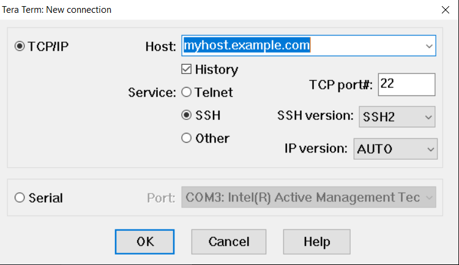
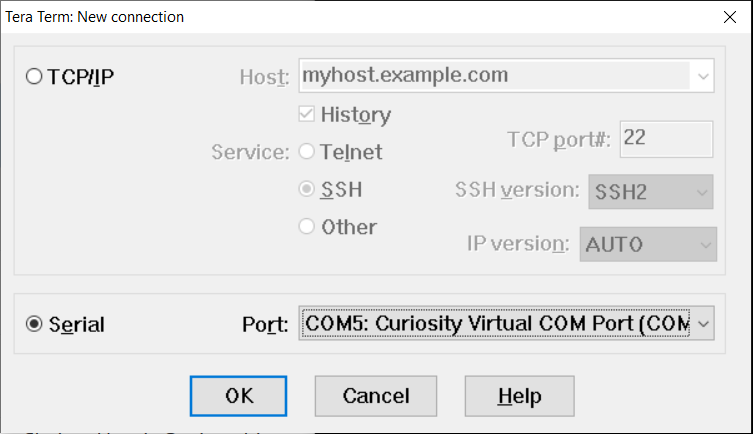
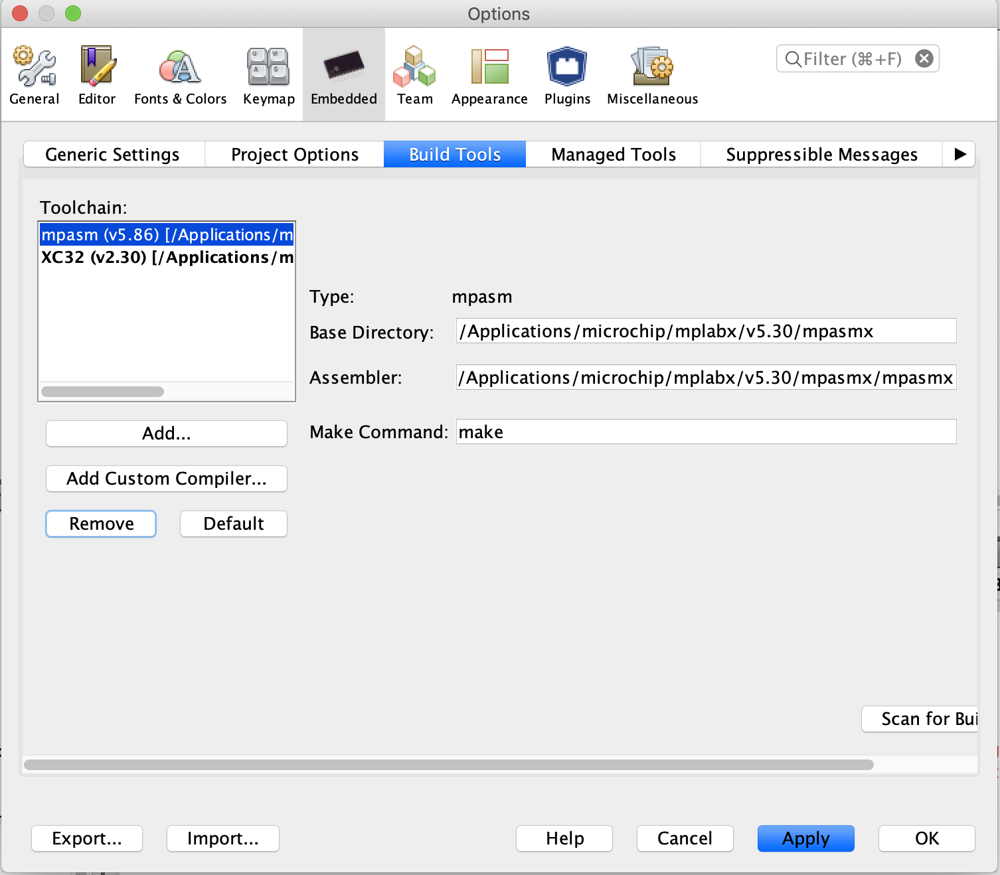
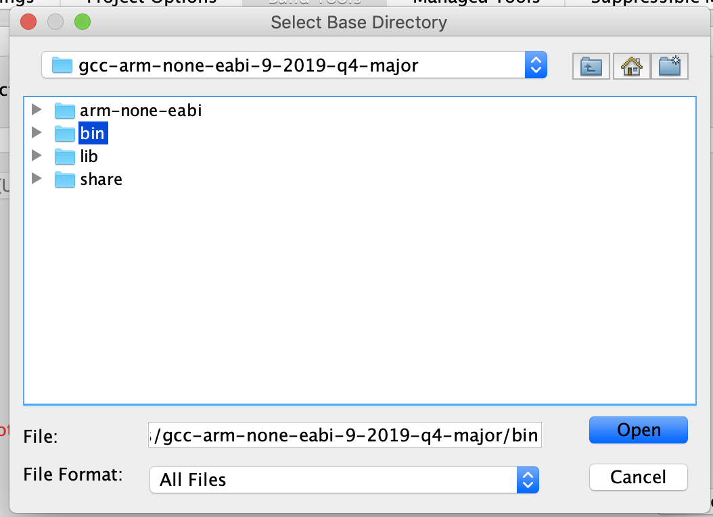

# Lab 2

This workshop is primarily driven by the documentation in the Microchip Trust Platform Design Suite located in trust_platform/DesignTools/Docs.  If there is any expansion or localized managed lab correction, it will be written here.

If you are running these steps in an unmanaged workshop capacity (in your own account) please implement the steps defined in the document **TrustFLEX_guide_AWS_demo_account_setup.pdf** before continuing.  In a managed workshop capacity this step has been done for you.

## Resource Generation

In this section, you will prepare the device resources for the ECC608A.

1. Open the document at `trust_platform/DesignTools/Docs/TrustFLEX_guide_custom_PKI_AWS.pdf`.
2. Connect your kit to your workstation.
   1. Remove the kit from the box.
   2. Connect the USB cable to the computer and then connect the other end of the cable to the kit.
3. Make a serial connection to the kit.  Choose one of the following depending on your operating system.
   1. **WINDOWS**
      1. Open the program **TeraTerm** you installed in Lab 1.  You will see a dialog box similar to the following.

         

      2. Click the **Serial** radio button, and select the COM port labeled **Curiosity Virtual COM Port** and then click **OK**.

         

      3. On the menu, click **Setup** and then **Serial port...**.
      4. For Speed, select 115200 and then click **New setting**.  (older TeraTerm versions will ask you to click **OK**)

         
      5. Press the reset button on the device.  You should see output similar to the following.

         

         If you do not see this, or see garbage similar to the following,

         ```text
         (APP)(INFO)Chip ID 1503a0
         ```

         you must [Reset the Image to the FACTORY IMAGE](https://microchipdeveloper.com/authentication:cryptoauth-factory-reset). 
         
         **IMPORTANT** click the **ERASE** button prior to **PROGRAM** for best results.  After program, click the reset button on the device once more to ensure you see the expected results in the serial terminal window.

         Otherwise, continue to the next major step.
   2. **OSX**
      1. Open a terminal, and type the following:
      ```
      ls /dev/cu.*
      ```

      2. Note the output, there should be something called `/dev/cu.usbmodemXXXXX` where X should numbers. 
      
      3. Type the following:
      ```
      screen /dev/cu.usbmodemXXXXXX 115200
      ```

      4. You should see an output similar to the following:
      

      5. If the output scrolls continously, ensure that the WiFi credential you have configured in `aws_wifi_task.c` are correct. 

2. In the opened document, start with **Section 1**.  Select one of the following based on your operating system.
   1. **WINDOWS** To open the Navigator window, click the Windows **Start** icon, locate **Anaconda3 (64-bit)**, and click **Anaconda Navigator (trust_platform)**.
   2. **OSX** Launch Anaconda-Navigator from the Application folder

## Section 4: Use Case Prototyping

   1. Follow Section 4.1 in the PDF.
   2. Follow Section 4.2 in the PDF.  Jump to Section 4.2.2 since we are using MPLAB X.

      After loading the project, you will receive an error in the Project Loading Error tab.

      

      Follow these steps to resolve.

      1. In the Projects tab, right-click the `custom_pki_aws` project, and select **Properties** which is the last option in the menu.
      2. Under Categories, click **Conf: [Default]**.  You will see there is an DFP load error under **Packs**.

         

      3. Click the **Resolve** Link. You will receive a pop-up box.  Click **Yes**.

         

      4. You will then receive a pop-up box asking you to load the installed pack.  Click **Yes**.

         

   3. Follow the steps in section 4.2.2.

### ERRATA - MacOS

Before proceeding with session 4.2.2 ensure that the ARM toolchain has been added to MPLAB X IDE.

1. With MPLAB X IDE open and in the foreground, click on the **MPLAB X IDE** text on the menu bar and then **Preferences**

2. Select the **Build Tools** tab and click on **Add**


3. Browse to the location where you have expanded the **gcc-arm-none-eabi-9-2019-q4-major-mac.tar.bz2** in the previous lab, select the **gcc-arm-none-eabi-9-2019-q4-major-mac/bin** folder


4. Click **Open**

5. Click **Ok**

6. Click **Ok** (this is not an error, you have to click Ok twice)

Now the ARM toolchain is installed and configured.

### Errata - MacOs 2

In order for the Microchip AWS integration tool to work, one must ensure that the [default] profile in the `~/.aws/config`,, and the `~/.aws/credentials` files contain the rigth entries for the account to be used.


Congratulations! You have completed Lab 2!
